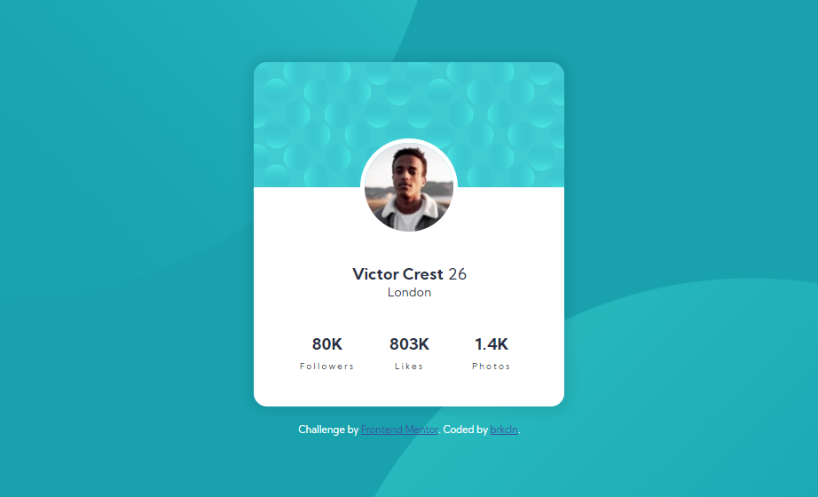

# Frontend Mentor - Profile card component solution

This is a solution to the [Profile card component challenge on Frontend Mentor](https://www.frontendmentor.io/challenges/profile-card-component-cfArpWshJ). Frontend Mentor challenges help you improve your coding skills by building realistic projects.

## Table of contents

- [Overview](#overview)

  - [The challenge](#the-challenge)
  - [Screenshot](#screenshot)
  - [Links](#links)
  - [Built with](#built-with)
  - [Useful resources](#useful-resources)

- [Author](#author)

## Overview

### The challenge

- Build out the project to the designs provided

### Screenshot

### Links

- Solution URL: [Challange](https://your-solution-url.com)
- Live Site URL: [Live site](https://brkcln.github.io/profile-card-component-main)

### Built with

- Semantic HTML5 markup
- CSS
- Flexbox
- BEM

### Useful resources

- [stackoverflow](https://stackoverflow.com/)
- [MDN web doc](https://developer.mozilla.org/)
- [Csstricks](https://css-tricks.com)

## Author

- Website - [@brkcln](https://brkcln.github.io/brkcln)
- Frontend Mentor - [@brkcln](https://www.frontendmentor.io/profile/brkcln)
- Github - [@brkcln](https://github.com/brkcln)
